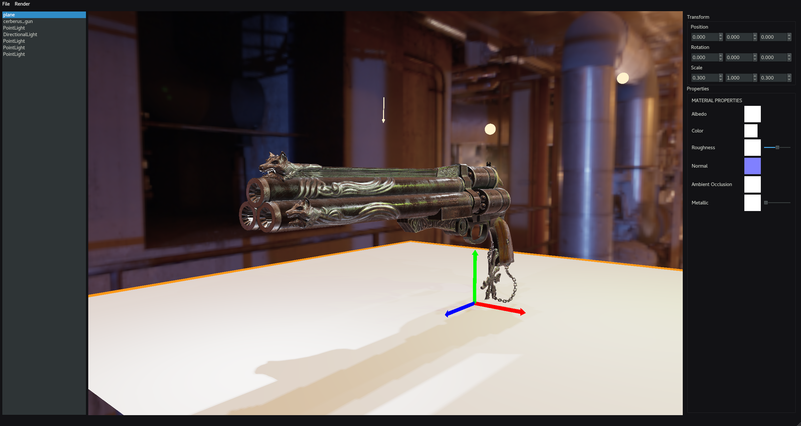

# Vlad Oancea's Assignment - Lightweight OpenGL Loader

## Project Summary
My projects consists of a real-time 3D PBR forward-render engine, able to interactively load and position meshes through an interface, assign them textures and display them using multiple types of lights or HDR environment maps and custom backgrounds. The lighting system supports multiple shadow-casting lights, reaching up to 4 point shadows and 8 directional shadows.
The software has Scene Serialization capabilities, being able to save scene files using the JSON format, as well as load them back in. Do be warned that the resources are saved by their absolute filepath, so changing a resource's directory will cause it to be unable to load.
The program allows you to render the resulted composition as a PNG, either by instantly capturing the current viewport as-is, or allowing you to specify a custom resolution going up to 4096x4096.

This could have the practical use of having a tool to quickly showcase models and textures, for either lookdev or personal projects, similar to Marmoset Toolbag, but as a small and lightweight software that renders purely in real-time.

## Implementation Details

### Model Loading
I used NGL's default Obj Loader class as a reference and extended it to be able to support both triangular and quad meshes. To achieve this, I had to figure out a way to store triangulate input meshes on the fly, so I started looking into methods that would allow me to achieve this.
A rather efficient and simple way to approach this would be to triangulate quads based on their shortest diagonal, which was I attempted first, however despite the simplicity of this algorithm, the results were unexpected and the outputs would turn out inconsistent. I arrived to the conclusion that winding-order might be the cause of it, so I started looking for an approach that would be order-independent of the vertices.
The solution I arrived to was polygon-center-triangulation. For each quad, I add an extra vertex in its center, with its UV and Normal averaged from the other 4 vertices, and then triangulate it with the quad's existing vertices. This method managed to produce consistent and high-quality results, so I decided to keep it.

### PBR Shading
After getting my mesh loading functionality in, I started looking into setting up the PBR shader system. My main source of learning was the [LearnOpenGL website](https://learnopengl.com/PBR/Lighting) , which has very thorough explanations about the mathematics and physics behind the methods used in PBR, alongside code examples and walkthroughs on how to configure it. I implemented directional and point lights in my code, and then proceeded to write and implement the shader, adding functionality for dynamic number of lights by rewriting and recompiling .glsl files at runtime. I would later return to this shader when implementing shadows and environment lighting.

### Mouse Picking
I added mouse picking functionality by using a second color attachment to my framebuffer, which only holds integers, and storing the Object ID through the fragment shader. I then read from the buffer at the mouse position whenever I want to know which object I am hovering over. I have written and designed my own FrameBuffer class to handle creation and management of attachments, allowing me to easily configurate opengl framebuffers.

### Gizmos
One feature I wanted to implement as a quality of life addition was a transformation gizmo that would allow the user to easily manipulate selected objects. I couldn't find many online sources on how to approach this, but after collecting information from various scattered sources, I decided I would have my gizmo as a mesh that I procedurally create at the start of the program, and then draw it on top of everything else when an object is selected, using mouse picking to detect when I am clicking on it. Most solutions I've found online use raycasting from the mouse to detect collision with the gizmo, but since I already the picking system, I decided to integrate it into it.
I had a few problems with configuring the rotation to work on local axis, as the rotation matrix multiplication ordered made the axis dependent on eachother, so I implemented my own RotateByAxis function that makes use of quaternions.

### GUI
I designed a layout using QT Designer and integrated my existing scene into it, hooking up a simple transformation widget to my objects and using a ListView as a scene outliner. This process was rather straightforward, however I had a few issues with building QT widgets and layouts on the fly in order to display the properties of each type of individual object. I got a working system that built an entirely new layout every time the user would select an object and passed it to QT to integrate it into the Properties layout, however, as I started building more and more complex layouts, this process turned out to be rather slow, sometimes taking up to 0.5 seconds just to select a mesh.
After some more thought and research, I decided to scrap that system and instead use a QStackedLayout, which allows me to store multiple layouts at the same time and only display each one when needed. I used this to "cache" the various types of layouts I can display as Properties and made it so that selecting an object simply checks its type and decides which layout to use, updating it with the proper connections and values.
This approach increased performance significantly and made the selection process almost instantaneous.
In addition, I've also had to implement a few custom widgets for my needs, as QT didn't have built-in functionality for them, such as a Texture Selector widget, a custom Color Picker widget, and a few others.

 

### Shadows
There are many sources online offering tutorials regarding implementing ONE shadow-casting light of each type, however there are very little covering multiple light shadows. After looking at my options, I decided that using Texture Arrays would probably suit best my forward-rendered, as they offer me the benefit of storing the shadow maps of each type of light in a single texture slot. Directional lights each have a framebuffer with an attachment linked to a layer of a Texture 2D array. Point lights use Texture Cube Arrays, which is stored ony my static PBR Manager, on which I use a geometry shader to loop through the first 4 and render the cube maps respectively. Integrating them into the PBR shader was just a matter of binding their texture arrays and accessing the appropriate index of the array based on which light we are rendering.

### Environment Lighting
In order to feel like I have a complete PBR render engine, I felt the need of adding support for HDR environment maps. Luckily, the rather lengthy and cumbersome process is well documented on the LearnOpenGL website, which I used as reference to implement it into my systems. I couldn't make use of ngl::Texture, as it didn't allow for HDR texture loading, so I imported stbi_image into my project and used it to do the processing. I then hooked the system up to QT and placed in the Scene Properties layout.

### Scene Serialization
After getting the hang of RapidJSON, I wrote a serialization system which takes the current scene and writes its properties and objects' properties into a scene file. Deserialization was just a matter of discarding everything in the current scene and re-creating objects based on the information found in the scene file.

### Asset Manager
The program makes use of an Asset Manager, which stores shared pointers to either meshes or textures in unordered_map-based caches, which are accessed through their filepath that acts as the Key. This system allows for efficient memory usage, as the user can add as many of a resource as they want, whilst only allocating one. The manager also has a Garbage Collection system that deletes from memory any unused resources, but at the time of submission it isn't always working consistently, so I resorted to only calling it when Deserializing scene to discard all current resources.

### Rendering Images
By making use of the stb_image_write library, I am simply re-rendering the scene with a custom viewport resolution, without any gizmos or selection outlines, then reading the data from the viewbuffer and writing it to a PNG file.

### Other
The code makes use of a static class PBRShaderManager which is used to store all of the global values related to rendering. I decided to use this approach as I realized a lot of mostly constant data has to be passed around the objects, so it would be safer and more convenient to store it statically in one easily accesible place, instead of having to design systems that need to pass a lot of parameters around.

As a last-minute implementation, I decided to implement a selection outline in the scene. Before that, I was simply drawing the wireframe on top of the selected object, which made it very difficult to visualize their colors in very dense topology. Luckily, I discovered that by making use of the Stencil Buffer and by slightly offsetting the vertices along their normals, I can achieve a pretty convincing outline effect. It's not perfect, as I am offsetting the vertices by a constant amount, meaning that bigger objects will look like they have smaller outlines, while small ones would have it thin, but for general-use it works fairly well.

I am also making use of a custom-implemented camera, which works very similar to how industry-standard software have their viewport cameras, where instead of a regular transform, we have a focal position around which we orbit, a distance from it, as well as a pitch and yaw, and calculate the required transforms from there. This way, we can get a more natural moving control, and also the ability to focus on specific objects (in this case by hitting the F key).

## Reflection and Self-Evaluation

For the final submission, I managed to implement all of the features I had in mind for a Minimum-Viable-Product fully-usable real-time PBR render engine. Functionality-wise, I believe it was almost everything an artist may need to generate quick renders of their meshes. However, there is still a lot of room for improvement and missing quality-of-life features. Some of them include: the ability to remove/revert textures to their initial solid-white state, the transformation gizmo being made up of 2D meshes, making it difficult to access from certain angles, ability to set a custom FOV of the camera, and the lack of a toggle to select whether a light should cast shadows. A few of them could have been easily implemented with a bit more of development time, but were deemed unnecessarry for the core functionality.
I also feel that I could have improved parts of my implementation, to make better use of polymorphism and to rely less on either down-casting or avoidable if statements in some scenarios, which I am aware can be a bad practice.

## Sample Scenes

In the repository I have left a folder with a couple of simple pre-made sample scenes to easily test out the program's capabilities. By default the software saves the paths to the resources using absolute paths, which would make it very difficult to send projects across other platforms. These scenes have their paths manually edited to be relative to the executable, one directory above it. This means that running the executable from the build folder of the project should be able to successfully load those projects.

## References
[0] learnopengl.com. (n.d.). LearnOpenGL - Lighting. [online] Available at: https://learnopengl.com/PBR/Lighting [Accessed 1 May 2022].
‌[1] learnopengl.com. (n.d.). LearnOpenGL - Specular IBL. [online] Available at: https://learnopengl.com/PBR/IBL/Specular-IBL [Accessed 1 May 2022].
[2] Hdrlabs.com. (2012). sIBL Archive. [online] Available at: http://www.hdrlabs.com/sibl/archive.html.
[3] www.turbosquid.com. (n.d.). Free 3D Plant Monster - TurboSquid 1873474. [online] Available at: https://www.turbosquid.com/3d-models/3d-plant-monster-1873474 [Accessed 31 May 2022].
[4] RenderHub. (n.d.). Biomechanical Mutant - Free 3D Model by Game-Ready Studios. [online] Available at: https://www.renderhub.com/game-ready-studios/free-biomechanical-mutant [Accessed 31 May 2022].
[5] artisaverb.info. (n.d.). Art Is A Verb - ‘Physically Based Next-gen Texturing for Artists’ by Andrew Maximov. [online] Available at: http://artisaverb.info/PBT.html [Accessed 3 May 2022].
[6] learnopengl.com. (n.d.). LearnOpenGL - Shadow Mapping. [online] Available at: https://learnopengl.com/Advanced-Lighting/Shadows/Shadow-Mapping.
[7] learnopengl.com. (n.d.). LearnOpenGL - Point Shadows. [online] Available at: https://learnopengl.com/Advanced-Lighting/Shadows/Point-Shadows.

‌
‌
‌
‌

‌

‌
